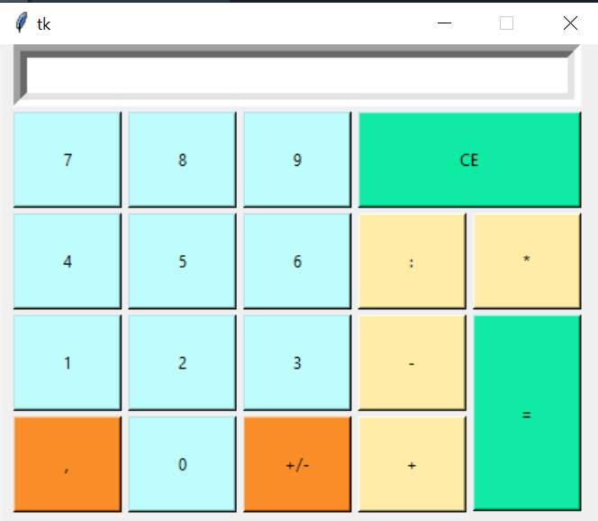

# Calculator

### Description

  This program creates a complete, working calculator. It can do addition, subtraction, 
  multiplication and division. Entrering numbers using the button on the screen.
  The calculator can work with negative or fractional numbers. Each button has its own color
  (for example: buttons responsible for numbers are blue color).
  All actions are displayed as on a regular calculator. 

