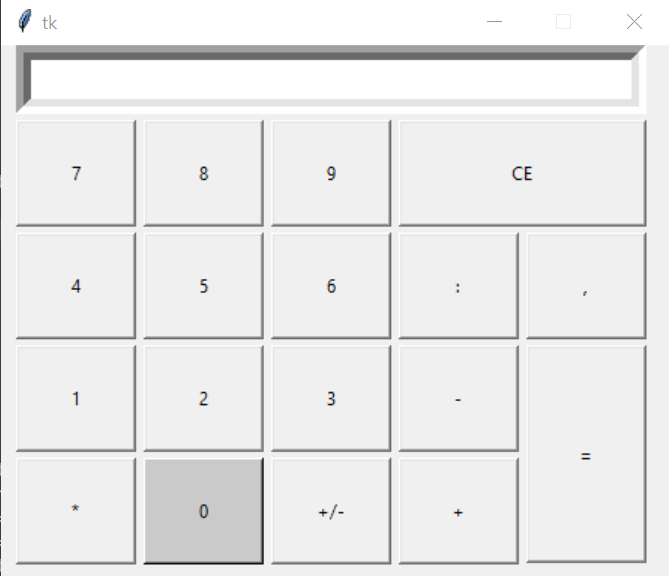

# Calculator

### Description

  This program creates a complete, working calculator.

### What can he do ?
 
* It can work with negative and fractionnal numbers.
* It can do: addition, subtraction, multiplication and division.

### How to work on it ?
 
to enter numbers, you need to use the buttons 
on the screen or the keyboard
and the rest of the actions are exactly the same as on a regular calculator.

### Todo

* button color
* button functionality
* screen functionality

### Done

* interface
